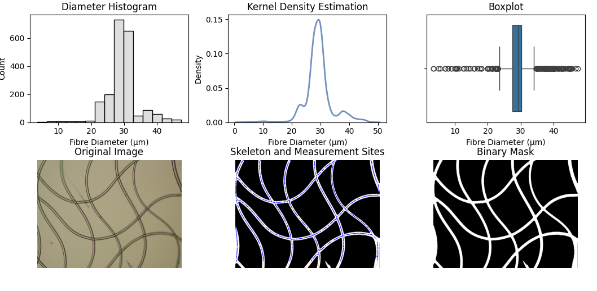
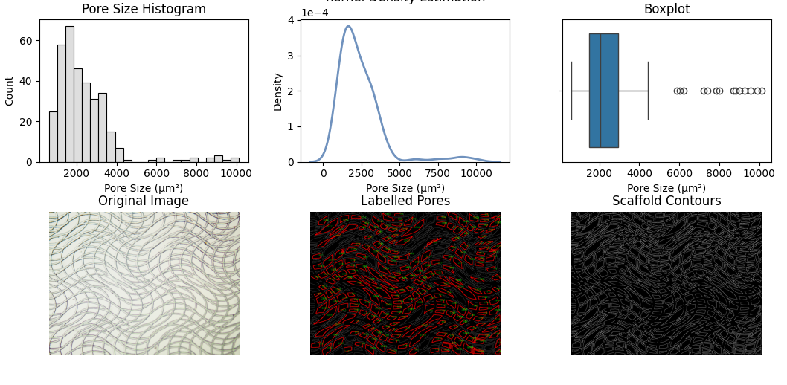

<h1> 
    FibreScope - Fibre Scaffold Analysis Software 
</h1>

 
    Scaffold analysis software designed for fibre diameter and fibre pore size measurement based on traditional CV solution.
    Fibre diameter is measured via continous sampling along normal direction of fibre edge.
    The input image will be processed and binarilised for diameter and area measurement.
    All measurement results are originally in pixel and needed to be converted to real life length.
    This project is still under active development and will be updated in near future.

<h2> 
    Example
</h2>

    An example of fibre diameter measurement result.

    An example of pore size measurement result.

<h2>
    Usage
</h2>

    <ul>
        <li>Import image via <code>File - Open Image</code> or using shortkey <code>Ctrl + I</code>. </l1>
        <li>Choose analysis mode under <code>Options</code> from <code>Fibre Measure</code> or <code>Pore Measure</code>.</li>
        <li>Run analysis under <code>Run</code> or using shortket <code>F5</code>.</li>
        <li>Save result as image via <code>File - Save Result</code> or using shortkey <code>Ctrl + S</code>.</li>
    </ul>
    <h3>
        About parameters
    </h3>
    

        <ul>
            <li>Scale Factor: the scale ratio between pixel to real length, needs to be measured depends on instrument setting up.</li>
            <li>Junction Exclusion Radius (JER): set the area where the measurement wouldn't be taken near fibre junctions and intersections for better measurements.</li>
        </ul>
    

        

 
    The cores are also supported to be imported and used. The core for diameter measurement and size measurement are <code>fibreMeasure.py</code> and <code>poresMeasure.py</code> under <code>core/fibreCore</code> and <code>core/poreCore</code>.
    Example codes for each module are shown below.

<h3> 
    Diameter Measurement
</h3>

    from fibre_measure import measure
    import numpy as np

    true_diameters, pairs, edge_mask = measure(r"example/image")
    average_diameter = np.average(true_diameters)

<h3> 
    Pore Size Measurement 
</h3>

    from pore_measure import measure
    import numpy as np

    area_arr, circularity_arr, solidity_arr, img_path = measure(r"example/image")
    average_area = np.average(area_arr)
    
