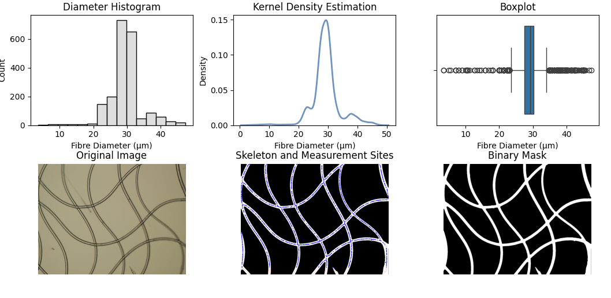
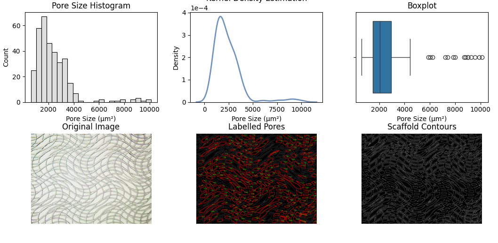

<h1> 
    FibreScope - Fibre Scaffold Analysis Software 
</h1>

 
    Scaffold analysis software designed for fibre diameter and fibre pore size measurement.
    The input image will be processed and binarilised for diameter and area measurement.
    Two <code>PointNet</code> deep-learning models were adopted for image pre-process procesure, requires <code>CUDA</code> for better performance.
    All measurement results are originally in pixel and needed to be converted to real life length.
    This project is still under development and will be updated in near future.

<h2> 
    Example
</h2>

    An example of fibre diameter measurement result.

    An example of pore size measurement result.

<h2>
    Usage
</h2>

 
    The cores are also supported to be imported and used. The core for diameter measurement and size measurement are <code>fibreMeasure.py</code> and <code>poresMeasure.py</code> under <code>core/fibreCore</code> and <code>core/poreCore</code>.
    Example codes for each module are shown below.

<h3> 
    Diameter Measurement
</h3>

    from fibreMeasure import FibreModel, measure
    import numpy as np

    fibreModel = FibreModel(r"example/model.pth")
    diameterList, _, _ = measure(r"example/image", fibreModel)
    averageDiameter = np.average(diameterList)

<h3> 
    Pore Size Measurement 
</h3>

    from poreMeasure import PoreModel, measure
    import numpy as np

    poreModel = PoreModel(r"example/model.pth")
    areaList, _, _ = measure(r"example/image", fibreModel)
    averageArea = np.average(areaList)
    
