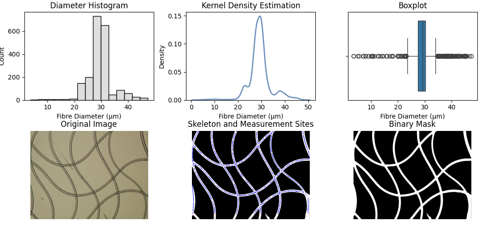
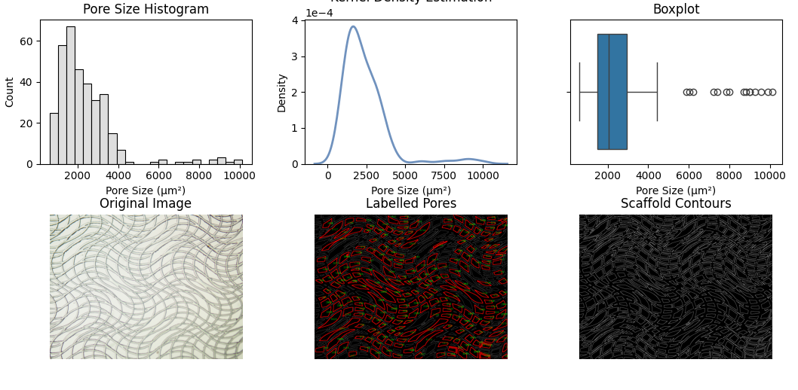

# FibreScope - Fibre Scaffold Analysis Software

Scaffold analysis software designed for fibre diameter and pore size measurement based on traditional CV solutions. Fibre diameter is measured via continuous sampling along the normal direction of fibre edges, using a per-sample edge-pairing method that combines skeleton-to-skeleton distance (d2) and skeleton-to-edge-boundary distance (d1) to reconstruct the true fibre diameter. Input images are processed and binarised for diameter and area measurement. All results are originally in pixels and need to be converted to real-world length units via the scale factor.

> This project is still under active development and will be updated in the near future.

## Installation

**Requirements:** Python 3.11+ and [uv](https://docs.astral.sh/uv/).

```bash
uv sync
```

This installs the runtime dependencies into a local `.venv`. Add `--group dev` to
also install the test/tooling dependencies (pytest, nox, ...).

### Build the C++ extension

The core measurement routines have an optional C++ accelerator (`measure_tool`). The Python fallbacks are used automatically if the extension is absent, but building it is strongly recommended for performance.

```bash
mkdir build
cd build
cmake ..
cmake --build . --config Release
```

The compiled `.so` / `.pyd` is placed in `lib/` and picked up automatically at runtime. The build requires CMake ≥ 3.15, a C++17 compiler, and the bundled pybind11 submodule (`src/cpp/extern/pybind11`).

### Run

```bash
uv run python run.py
```

## Example

Fibre diameter measurement result:



Pore size measurement result:



## Usage

1. Import an image via **File → Open Image** or `Ctrl + I`.
2. Choose an analysis mode under **Options**: `Fibre Measure` or `Pore Measure`.
3. Adjust parameters in the sidebar if needed, then click **Set** to apply.
4. Run analysis via **Run** or `F5`.
5. Save results via **File → Save Result** or `Ctrl + S`. A folder picker will appear; a timestamped sub-folder is created inside the chosen directory containing the result image, overlay PNG, and raw CSV.

### Parameters

All parameters can be adjusted in the sidebar and are persisted across sessions.

| Parameter | Default | Description |
|---|---|---|
| **Scale Factor** | 1.25 | Pixel-to-real-length ratio; depends on instrument magnification and camera setup. Multiply pixel measurements by this value to obtain real-world units. |
| **JER** | 40 | Junction Exclusion Radius (px) — skeleton points within this distance of a fibre junction or crossing are excluded before sampling, avoiding the artificially inflated widths that occur at intersections. |
| **Rate** | 0.5 | Sampling rate as a fraction of total skeleton points. 0.1 = fast but noisier estimate; 1.0 = full scan. 0.5 is a good balance for most images. |
| **MSD** | 50 | Maximum Search Distance (px) along the normal direction. Set to roughly 1.5–2× the expected fibre diameter; too small misses wide fibres, too large picks up neighbouring fibres. |
| **Smoothing** | 2.0 | Gaussian sigma applied during Hessian ridge enhancement. Increase for noisier images or thicker fibres; decrease to preserve fine detail. |
| **Threshold** | 0.15 | Normalised Hessian response cutoff for ridge mask extraction. Lower values include weaker ridges (may add noise); higher values keep only strong, clear fibres. |
| **OER** | 10.0 | Overlap Exclusion Radius (px) — after sampling, any single-hit measurement whose start point lies within this radius of a double-hit (fibre overlap) point is discarded, removing measurements contaminated by overlapping fibres. |

## API Usage

The core modules can be imported directly from `core/`.

### Diameter Measurement

```python
from fibre_measure import measure
import numpy as np

true_diameters, pairs, edge_mask, fibre_dict = measure(
    r"example/image",
    sample_rate=0.5,
    max_search_distance=50,
    jer=40,
    scale_factor=1.25,
    sigma=2,
    threshold=0.15,
)
average_diameter = np.average(true_diameters)
```

### Pore Size Measurement

```python
from pore_measure import measure
import numpy as np

area_arr, circularity_arr, solidity_arr, img_path = measure(r"example/image")
average_area = np.average(area_arr)
```

## Troubleshooting

**`ModuleNotFoundError: No module named 'measure_tool'`**  
The C++ extension has not been built or the output `.so`/`.pyd` is not on `sys.path`. Build the extension (see [Installation](#installation)) and confirm `lib/measure_tool*.so` (Linux/macOS) or `lib/measure_tool*.pyd` (Windows) exists. The Python fallbacks will be used automatically if the file is missing, at the cost of slower performance.

**Parameter validation — red border on an input field**  
The value entered is outside the allowed range or is not a valid number. Each field has a hard limit (e.g. Rate must be in [0.01, 1.0]). Correct the value and click **Set** again. Valid fields are still saved even when one field fails.

**"No image selected" warning when running analysis**  
No image path has been stored in `config.json`. Open an image first via **File → Open Image** (`Ctrl + I`) before running.

**Analysis completes but detects very few fibres / produces no result**  
- **Threshold too high**: lower the Threshold parameter so more ridge pixels are included in the mask.  
- **Smoothing mismatch**: if fibres are thin, try Smoothing = 1.0–1.5; if fibres are thick, try 2.5–3.0.  
- **MSD too small**: increase MSD so the search ray can reach the opposite fibre edge.  
- **Image contrast**: the pipeline applies adaptive histogram equalisation (CLAHE), but very low-contrast or overexposed images may still fail to produce a clear ridge mask.

**Results are noisy / many outliers / few results in measurement?**  
- Increase **JER** to mask more of the junction regions.  
- Increase **OER** to suppress measurements near fibre overlaps.  
- Reduce **Rate** to lower statistical noise from borderline skeleton points.
- Reduce **JER** if the scaffold is too dense.
- Increase **OER** if too many measurements are at overlapping site.

**`config.json` is missing keys on startup**  
The application automatically back-fills missing keys with default values from the `DEFAULTS` dictionary in `main.py`. If the file is corrupt, delete it and restart — a fresh one will be generated on next save.
